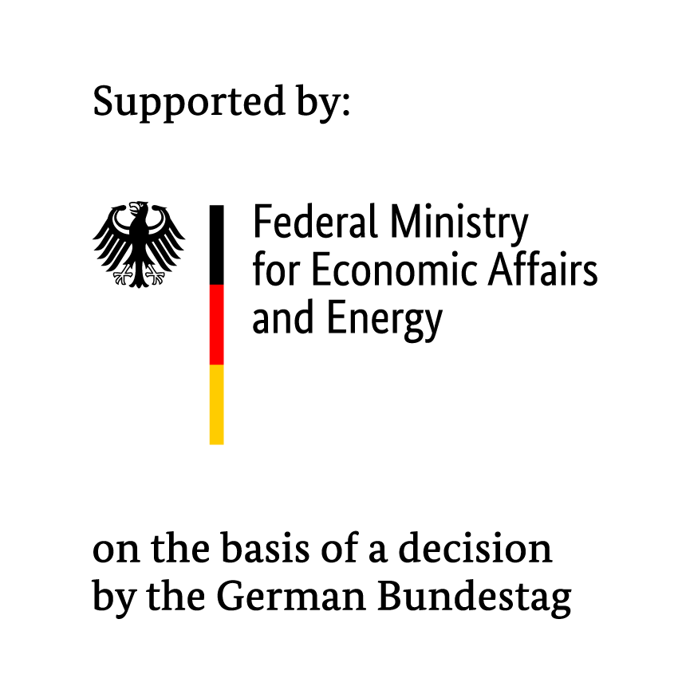

# Resilience Evaluation Testbed for PPS Manipulation

This project contains a software stack for controlling the PPS signal delay that can be fed into a PTP server or other devices using PPS for internal time tagging or synchronization. A detailed explanation is given in the publication proceedings of ISPCS 2026 (Resilience Evaluation Testbed for PPS Manipulation of GNSS Synchronized Measurement Equipment)

## User Interface
The user interface provides a simple-to-use interface to define a trajectory of the desired PPS manipulation. It also interfaces with a local PTP monitoring application that can monitor up to four PTP sources on a PTP capable quad port Ethernet interface.

## SCPI interface
The SCPI interface is used to remotely control a function generator that is generating the delayed PPS signal.

## nic_time_reader
The nic time reader is used to control the experiment on the receiver side. It includes the control of a warm-up period and the reading period. It furthermore records the monitoring results in a CSV file.

## License

This software is licensed under the Apache open-source license. Please refer to the license file in the `LICENSE`.

We kindly ask all academic publications employing components of this work to cite the following paper:

For other licensing options please consult [Prof. Antonello Monti](mailto:amonti@eonerc.rwth-aachen.de).

## Contact

- Manuel Pitz <manuel.pitz@eonerc.rwth-aachen.de>
- Sebastian Uerlich <sebastian.uerlich@eonerc.rwth-aachen.de>
- Linus Knaack <linus.knaack@rwth-aachen.de>

[Institute for Automation of Complex Power Systems (ACS)](http://www.acs.eonerc.rwth-aachen.de)
[EON Energy Research Center (EONERC)](http://www.eonerc.rwth-aachen.de)
[RWTH University Aachen, Germany](http://www.rwth-aachen.de)

## Acknowledgment

This research has received funding from the European Union’s Horizon Europe research and innovation programme under grant agreement No 101172829. Views and opinions expressed are however those of the author(s) only and do not necessarily reflect those of the European Union or CINEA. Neither the European Union nor the granting authority can be held responsible for them.

We are grateful for the financial support of the [BMWE (Federal Ministry of Economic Affairs and Energy)](https://www.bundeswirtschaftsministerium.de/Navigation/EN/Home/home.html), funding reference [03EI6125A](https://www.enargus.de/pub/bscw.cgi/?op=enargus.eps2&q=beaver&v=10&id=243841191).

